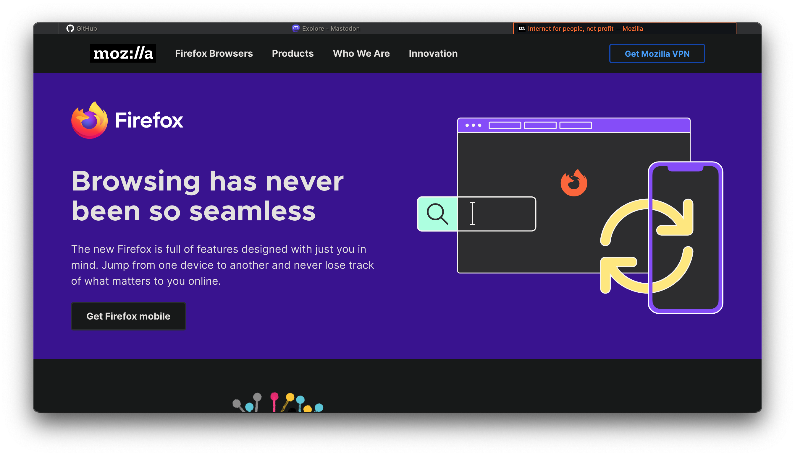

# Minima
*Minimalist Firefox Theme inspired by qutebrowser*

## What this does
Gives Firefox a minimalist appearance and only shows the url bar when it's focused (<kbd>CTRL</kbd> + <kbd>L</kbd>). Also, the tab bar is completely hidden when only one tab is opened, leaving the entire window for the website. 
## Installation
1. Create a folder with the name `chrome` in your Firefox profile directory and copy the `userChrome.css` into it. To find your profile directory, go to about:support or about:profiles.
2. Go to about:config and set `toolkit.legacyUserProfileCustomizations.stylesheets` to `true`
3. Restart Firefox.
### Nix
If you're using [Nix](https://nixos.org/) to manage your system, you can install the theme in a declerative way too:
```nix
programs.firefox = {
    enable = true;
    profiles.default = {
      isDefault = true;
      userChrome = ''
        @import "${
            builtins.fetchGit {
                url = "https://github.com/rockofox/firefox-minima";
                ref = "main";
                rev = "96da97aa71ef4bf61feaa4d54395598e3bd7f0d3"; # <-- Change this
            }
          }/userChrome.css";
          '';
    };
    settings = {
        # Enable userChrome customizations
        "toolkit.legacyUserProfileCustomizations.stylesheets" = true;
    };
};
```
You will need to specify what revision to fetch, see [`fetchGit` documentation](https://nixos.org/manual/nix/stable/language/builtins.html#builtins-fetchGit) for more information.
